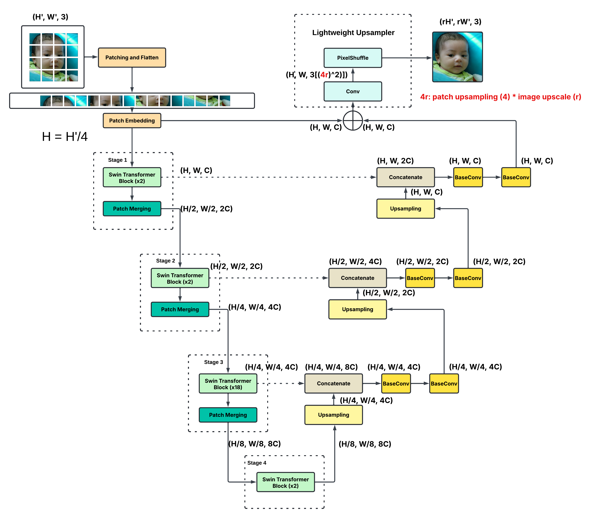
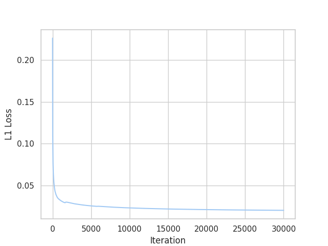
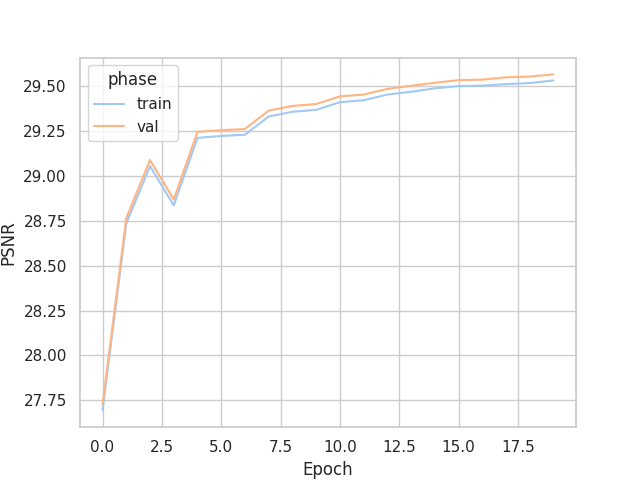
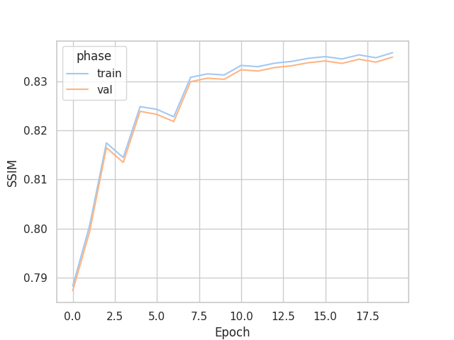

# SwinUnetSR

This project uses **SwinUnetSR** as the model, which combines [Swin Transformer (V2)](https://arxiv.org/pdf/2111.09883), [U-Net decoder](https://arxiv.org/pdf/1505.04597) and a lightweight upsampler together. The model is fine-tuned upon [SwinV2-B](https://huggingface.co/microsoft/swinv2-base-patch4-window8-256). FSR task is just to test the feasibility of SwinUnetSR, and the model might be applied to more complicated scenarios in the future.




## Prerequisites

- NVIDIA GPU (it runs super slow on CPU)

- Install [uv](https://docs.astral.sh/uv/getting-started/installation/)

- Install [Python 3.11](https://docs.astral.sh/uv/guides/install-python/#installing-a-specific-version)

- The pipeline was only tested on Ubuntu 22.04. Should work on any Linux system, Windows (if you know how to make symlinks with Windows)

FYI, **My spec** is:

- Intel Core i7 13700KF

- NVIDIA GeForce RTX 4070 Ti (12GB)

- USCORSAIR VENGEANCE 64GB (16GBx4)

And some basic training info:

|     **Scale Factor**    	|           **Batch Size**          	|                **LR**               	| **Epochs** 	| **Iterations/epoch** 	|
|:-----------------------:	|:---------------------------------:	|:-----------------------------------:	|:----------:	|:--------------------:	|
|            x4           	|                 16                	|                 2e-4                	|     20     	|         1500         	|

| **Training time/epoch** 	| **Evaluation-Training set/epoch** 	| **Evaluation-Validation set/epoch** 	|
|:-----------------------:	|:---------------------------------:	|:-----------------------------------:	|
|       6 mins 17 s       	|            2 mins 21 s            	|                 17 s                	|


## Dataset
I choose Flickr-Faces HQ ([FFHQ](https://www.kaggle.com/datasets/arnaud58/flickrfaceshq-dataset-ffhq)) dataset as a start. 


You can add your own dataset but have to follow these steps:

- Download the **HR image** dataset you want and symlink it to `datasets/<your-hr-dataset-name>`

```bash
mkdir -p datasets
ln -s "<full-path-to-your-dataset-folder>" "datasets/<your-dataset-name>"
```

- Run the script generating low-resolution (LR, 128x128) images and high-resolution (HR, 512x512) images

```bash
uv run scripts/generate_low_high_res_images.py "datasets/<your-dataset-name>"
```

In my case it is

```bash
uv run scripts/generate_low_high_res_images.py "datasets/ffhq"
```

This will generate LR and HR images separately in `datasets/<your-dataset-name>_lr_<lr_resolution>`
and `datasets/<your-dataset-name>_hr_<hr_resolution>`

- Change the dataset path in `./configs/train/<your-config-name>.toml`. `start_pos` and `end_pos` controls
the start and end point of images you wanna load

```bash
# ./configs/train/ffhq_swin_unet_fsr_x4.toml
...

[data]
low_res_dir = "<your-lr-dataset-name>"
high_res_dir = "<your-hr-dataset-name>"
end_pos = 30000  # comment this line to load full data


...
```

And you are all set!

## Train
x4 Scale:
```bash
uv run swin-unet-sr train "ffhq_swin_unet_fsr_x4"
```

This will train SwinUnetSR based on the config in `./configs/train/ffhq_swin_unet_fsr_x4.toml`.

All metrics will be recorded to TensorBoard, so you can check it with 
```
uv run tensorboard --logdir="runs"
```

The best checkpoint will be saved to `ckpts/<your-model-name>`

## Test
x4 Scale:
```bash
uv run swin-unet-sr test "ffhq_swin_unet_fsr_x4"
```
This will run the test based on the config in `./configs/test/ffhq_swin_unet_fsr_x4.toml`

## Plots




**NOTE**: During the training, metrics are recorded in TensorBoard. However, the plots downloaded from TensorBoard are all blurry, so I wrote a notebook converting CSV files of TensorBoard to seaborn plots. 
The code is on [colab](https://colab.research.google.com/drive/1q45stMwWKOulCL_A8X9p3fo9slmhNGvK?usp=sharing) and you can reproduce the result following the instruction in the notebook.

## Citing
```
@inproceedings{liu2021swinv2,
  title={Swin Transformer V2: Scaling Up Capacity and Resolution}, 
  author={Ze Liu and Han Hu and Yutong Lin and Zhuliang Yao and Zhenda Xie and Yixuan Wei and Jia Ning and Yue Cao and Zheng Zhang and Li Dong and Furu Wei and Baining Guo},
  booktitle={International Conference on Computer Vision and Pattern Recognition (CVPR)},
  year={2022}
}
```
